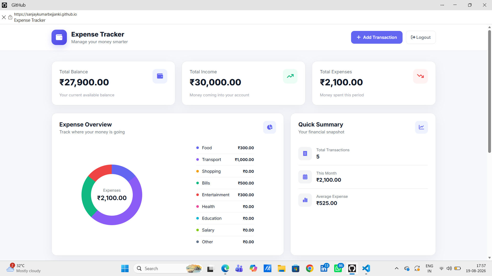
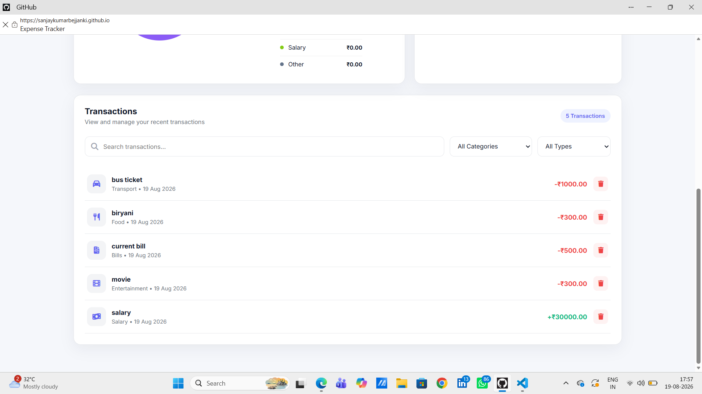
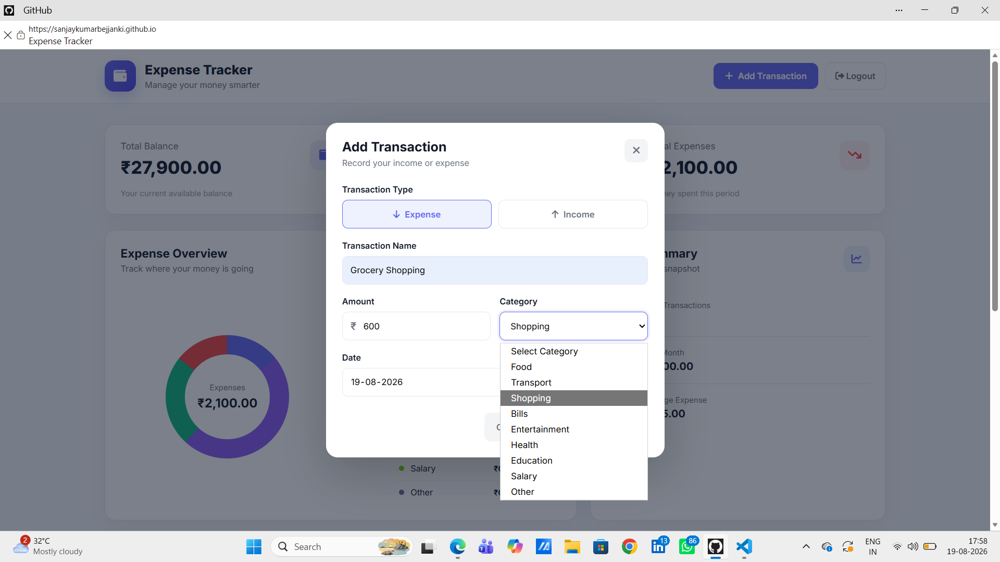

# 💰 Expense Tracker

A professional and responsive Expense Tracker web application built with **HTML, CSS, and JavaScript**.

The application helps users manage income and expenses, track their financial balance, search and filter transactions, and visualize spending through a dynamic expense chart.

## 🌐 Live Demo

### 🚀 Vercel
https://expense-tracker-gamma-neon.vercel.app/

### 📘 GitHub Pages
https://sanjaykumarbejjanki.github.io/expense-tracker/

---

## 📌 Project Overview

Expense Tracker is a frontend web application designed to make personal expense management simple and intuitive.

Users can add income and expense transactions, organize them by category, search and filter records, and view automatically calculated financial summaries.

The application uses browser **LocalStorage** so transaction data remains available after refreshing or reopening the website.

---

## ✨ Features

- 💰 Add income and expense transactions
- 📊 Automatic balance calculation
- 📈 Automatic income and expense summaries
- 🧾 Transaction management
- 🗑️ Delete transactions
- 🔍 Search transactions
- 🏷️ Filter transactions by category
- ↕️ Filter transactions by income or expense
- 💾 LocalStorage data persistence
- 📊 Dynamic expense chart
- 📅 Monthly expense tracking
- 🧮 Average expense calculation
- 🇮🇳 Indian Rupee (₹) currency formatting
- 📱 Responsive user interface

---

## 🛠️ Technologies Used

| Technology | Purpose |
|------------|---------|
| HTML5 | Structure of the application |
| CSS3 | Styling and responsive UI |
| JavaScript | Application logic and calculations |
| Chart.js | Dynamic expense visualization |
| LocalStorage | Persistent transaction data |
| Font Awesome | UI icons |

---

## 📊 Dashboard

The dashboard provides users with important financial information including:

- Total Balance
- Total Income
- Total Expenses
- Monthly Expenses
- Average Expense
- Expense Overview

The dashboard automatically updates whenever a transaction is added or deleted.

---

## 🔎 Search & Filtering

Users can quickly find transactions using:

- Transaction search
- Category filtering
- Income/Expense filtering

This makes it easier to manage a large number of transactions.

---

## 💾 Data Persistence

The application uses the browser's **LocalStorage API** to store transaction data.

This means transactions remain available after:

- Refreshing the browser
- Closing the browser
- Reopening the application

---

## 📊 Dynamic Expense Visualization

The application includes a dynamic expense chart powered by **Chart.js**.

The chart automatically updates based on the user's actual expense data and category distribution.

---

## 📸 Screenshots

### Dashboard



### Add Transaction



### Search & Filtering



---

## 📂 Project Structure

```text
expense-tracker/
│
├── index.html
├── style.css
├── script.js
├── README.md
│
└── screenshots/
    ├── dashboard.png
    ├── add-transaction.png
    └── filtering.png
```

---

## ▶️ How to Run

### Run Locally

1. Clone the repository:

```bash
git clone https://github.com/SanjaykumarBejjanki/expense-tracker.git
```

2. Open the project folder:

```bash
cd expense-tracker
```

3. Open the project in **VS Code**.

4. Open `index.html` using **Live Server**.

---

## 🚀 Deployment

This project is deployed using:

- Vercel
- GitHub Pages

### Live Application

**Vercel:**  
https://expense-tracker-gamma-neon.vercel.app/

**GitHub Pages:**  
https://sanjaykumarbejjanki.github.io/expense-tracker/

---

## 🔮 Future Improvements

- 🌙 Dark/Light mode
- ✏️ Edit existing transactions
- 📥 Export transactions to CSV
- 📅 Monthly and yearly reports
- 💰 Budget management
- 📊 Advanced financial analytics
- ☁️ Cloud database integration
- 🔐 User authentication

---

## 👨‍💻 Author

### Sanjay Kumar

**B.Tech — Computer Science & Engineering (AI & ML)**

GitHub:  
https://github.com/SanjaykumarBejjanki

---

⭐ If you found this project useful, consider giving it a star!
